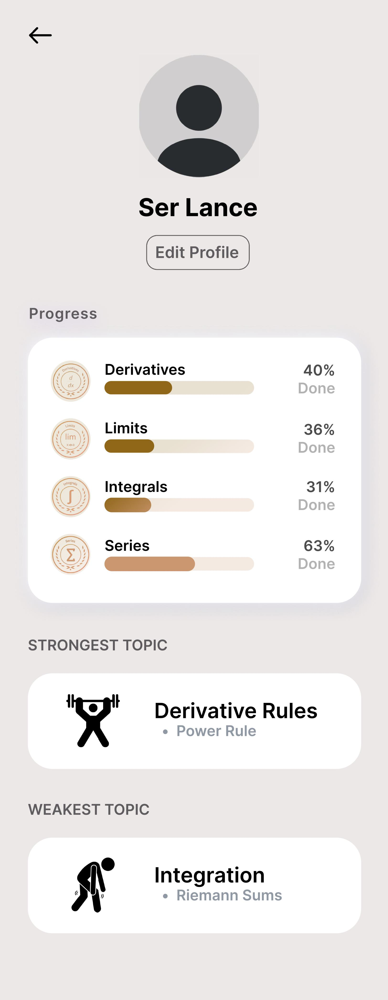

# 🧠 **NeuroMath Web Design**  

This repository contains the **Figma design** for the **NeuroMath mobile app web interface**.  
The design focuses on an **intuitive and modern UI** for **NeuroMath: An AI-Powered Adaptive Learning Platform for Personalized Mathematics Education**.  

This project was created in compliance with our **Software Engineering II** course.  
It also includes a **mock thesis** outlining the research and development process.  

📌 **Note:** Currently, NeuroMath is designed **exclusively for Calculus**, providing step-by-step problem-solving and personalized learning experiences.  
Future updates will expand the platform to cover **more mathematical topics** and enhance its AI-driven adaptability.  

---

## 📄 **View the Design**  
🔹 **Figma Design:** [NeuroMath Figma File](https://www.figma.com/design/tcCbQS0Q8xgqzr9sZyGjHU/NeuroMath?node-id=0-1&t=rGBO2q7h2GkCpgdk-1)  

---

## 🎨 **Features**  
- 📌 **Modern and user-friendly UI** for seamless navigation  
- 🔢 **Interactive learning sections** tailored for Calculus  
- 📊 **Analytics dashboard** for tracking progress and identifying weak areas  
- 🎮 **Gamified elements** to enhance engagement and motivation  
- 📱 **Fully responsive design** optimized for both mobile and web  

---

## 📸 **Preview**  

### 🏠 **NeuroMath Profile Page**  
**The Profile Page provides an overview of user performance, tracking strengths and weaknesses based on completed exercises.**   
It offers personalized recommendations for areas that need improvement, helping students focus on key concepts.  

  

  

---

## 📂 **Files in this Repository**  
- `README.md` → Project details and links  
- `images/` → Screenshots of the design  

---

## 🏆 **Creators**  
📌 [**Lance Adrian**](github.com/lncadrnn)  
📌 [**Meioseii**](github.com/meioseii)  
*Developed for Software Engineering II*  

---
